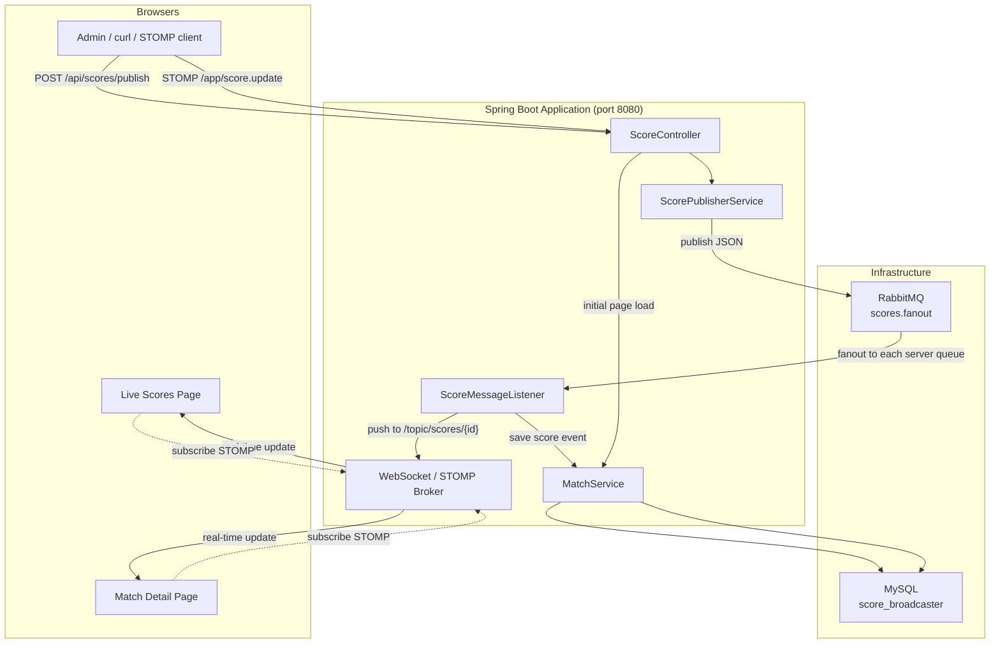

# Real-Time Score Broadcaster

A sports score broadcasting system built with **Spring Boot**. When an admin publishes a score update, the change is broadcast in real time to every connected browser — without refreshing the page.

This document explains **what the system does**, **how it is built**, and **how to run and test it** — whether you are new to the project or reviewing it as a senior engineer.

---

## Table of Contents

1. [What Problem Does This Solve?](#what-problem-does-this-solve)
2. [Glossary (Start Here If You Are New)](#glossary-start-here-if-you-are-new)
3. [High-Level Architecture](#high-level-architecture)
4. [End-to-End Flow (Step by Step)](#end-to-end-flow-step-by-step)
5. [Tech Stack](#tech-stack)
6. [Project Structure](#project-structure)
7. [Database Design](#database-design)
8. [API & Pages Reference](#api--pages-reference)
9. [Prerequisites & Setup](#prerequisites--setup)
10. [How to Run](#how-to-run)
11. [How to Test](#how-to-test)
12. [Configuration](#configuration)
13. [Design Decisions (For Senior Readers)](#design-decisions-for-senior-readers)
14. [Troubleshooting](#troubleshooting)

---

## What Problem Does This Solve?

Imagine a sports website during a live football match:

- An **admin** updates the score (e.g. Arsenal 3 – 1 Chelsea, 78th minute).
- **Thousands of users** watching the match should see the new score **instantly**.
- The score must also be **saved** so users can see match history later.

This application does exactly that using three main ideas:

| Idea | Technology used |
|------|-----------------|
| Store matches and history | **MySQL** + **Spring Data JPA** |
| Broadcast updates across servers | **RabbitMQ** (message broker) |
| Push live updates to browsers | **WebSocket** + **STOMP** |

---

## Glossary (Start Here If You Are New)

| Term | Simple explanation |
|------|-------------------|
| **REST API** | HTTP endpoints (GET/POST) that return or accept JSON data. |
| **JSP** | Java Server Pages — HTML pages generated on the server with live data from the database. |
| **WebSocket** | A persistent connection between browser and server for real-time, two-way communication. |
| **STOMP** | A simple messaging protocol used *on top of* WebSocket (like a language both sides speak). |
| **SockJS** | A fallback library so WebSocket works even when proxies/firewalls block it. |
| **RabbitMQ** | A **message broker** — a middleman that receives messages and delivers them to interested consumers. |
| **Fanout exchange** | A RabbitMQ pattern that sends every message to **all** bound queues (broadcast to all servers). |
| **DTO** | Data Transfer Object — a plain Java class used to send/receive data in APIs (not a database table). |
| **Entity** | A Java class mapped to a database table via JPA/Hibernate. |
| **JPA** | Java Persistence API — lets you work with the database using Java objects instead of raw SQL. |

---

## High-Level Architecture



### Three layers in plain English

1. **Presentation** — JSP pages + JavaScript (SockJS/STOMP) show scores and listen for live updates.
2. **Application** — Spring services, controllers, and listeners handle business logic and messaging.
3. **Infrastructure** — MySQL stores data; RabbitMQ distributes score updates to every running app instance.

---

## End-to-End Flow (Step by Step)

### A. User opens the live scores page

```
Browser  →  GET /scores/live  →  MatchService  →  MySQL
                ↓
         live-scores.jsp rendered with current LIVE matches
                ↓
         JavaScript connects to /ws (SockJS + STOMP)
                ↓
         Subscribes to /topic/scores/1, /topic/scores/2, ...
```

The page loads **initial data from the database**. After that, it waits for **WebSocket messages** to update scores without a refresh.

### B. Admin publishes a score update

```
Admin  →  POST /api/scores/publish  (JSON body)
              ↓
         ScoreController.processAndPublish()
              ↓
         ScorePublisherService  →  RabbitMQ exchange "scores.fanout"
              ↓
         HTTP 202 Accepted (message is queued, not yet in DB)
```

> **Important:** The REST response only means the message was **sent to RabbitMQ**. The database and browser are updated in the next steps.

### C. Listener receives and processes the message

```
RabbitMQ  →  ScoreMessageListener (per-server exclusive queue)
              ↓
         1. Push to WebSocket topic: /topic/scores/{matchId}
              ↓
         2. MatchService.recordScoreEvent()  →  MySQL (score_events table)
```

Every running application instance has its **own** RabbitMQ queue bound to the fanout exchange, so **each server** gets a copy of every score update and can push to its connected browsers.

### D. Browser receives the update

```
STOMP message on /topic/scores/1
    ↓
JavaScript updates score card / timeline in the DOM (no page reload)
```

---

## Tech Stack

| Layer | Technology | Version |
|-------|------------|---------|
| Language | Java | 17 |
| Framework | Spring Boot | 3.2.12 |
| Build | Maven | 3.6+ |
| Database | MySQL | 8.0 |
| ORM | Spring Data JPA / Hibernate | (via Boot) |
| Message broker | RabbitMQ | 3.x / 4.x |
| Real-time | Spring WebSocket + STOMP | (via Boot) |
| Frontend views | JSP + JSTL + Bootstrap 5 | CDN |
| Utilities | Lombok, ModelMapper | — |

---

## Project Structure

```
src/main/java/com/scorebroadcaster/
├── ScoreBroadcasterApplication.java   # Main entry point
├── config/
│   ├── RabbitMQConfig.java            # Fanout exchange, queues, JSON converter
│   ├── WebSocketConfig.java           # STOMP endpoint /ws, /topic broker
│   ├── WebMvcConfig.java              # MVC configuration
│   ├── ModelMapperConfig.java         # Entity ↔ DTO mapping
│   ├── RabbitConnectionMonitor.java   # RabbitMQ connection lifecycle logs
│   └── SecurityConfig.java            # Placeholder for future auth
├── controller/
│   └── ScoreController.java           # REST + JSP + STOMP endpoints
├── service/
│   ├── MatchService.java              # Match & score event business logic
│   └── ScorePublisherService.java     # Publishes to RabbitMQ
├── repository/
│   ├── MatchRepository.java
│   └── ScoreEventRepository.java
├── entity/
│   ├── Match.java                     # matches table
│   ├── ScoreEvent.java                # score_events table
│   ├── MatchStatus.java               # SCHEDULED, LIVE, FINISHED, POSTPONED
│   └── EventType.java                 # GOAL, OWN_GOAL, PENALTY
├── dto/
│   ├── ScoreUpdateDTO.java            # Score update message (RabbitMQ + API)
│   ├── MatchDTO.java                  # Match summary for lists
│   ├── MatchDetailDTO.java            # Match + score history
│   ├── ScoreEventDTO.java             # Single score event
│   └── CreateMatchRequest.java        # Create match request
├── listener/
│   └── ScoreMessageListener.java      # RabbitMQ → WebSocket + DB
└── exception/
    ├── MatchNotFoundException.java
    └── GlobalExceptionHandler.java

src/main/webapp/WEB-INF/views/
├── live-scores.jsp                    # All live matches grid
└── match-detail.jsp                   # Single match + timeline

src/main/resources/
├── application.properties             # All configuration
└── data.sql                           # Sample seed data (optional)
```

---

## Database Design

### Table: `matches`

| Column | Type | Description |
|--------|------|-------------|
| id | BIGINT | Primary key |
| home_team | VARCHAR | Home team name |
| away_team | VARCHAR | Away team name |
| match_date | DATETIME | Scheduled kick-off time |
| venue | VARCHAR | Stadium name |
| status | ENUM string | SCHEDULED, LIVE, FINISHED, POSTPONED |

> Current score and minute are **not** stored on `matches`. They are derived from the **latest** row in `score_events`.

### Table: `score_events`

| Column | Type | Description |
|--------|------|-------------|
| id | BIGINT | Primary key |
| match_id | BIGINT | FK → matches.id |
| home_score | INT | Home score after this event |
| away_score | INT | Away score after this event |
| minute | INT | Match minute |
| event_type | ENUM string | GOAL, OWN_GOAL, PENALTY |
| scoring_team | VARCHAR | Team that scored |
| created_at | DATETIME | When the event was recorded |

### Relationship

```
matches (1) ──────< (many) score_events
```

---

## API & Pages Reference

### Web pages (JSP)

| URL | Description |
|-----|-------------|
| `GET /` | Redirects to `/scores/live` |
| `GET /scores/live` | Live scores grid with WebSocket updates |
| `GET /scores/match/{matchId}` | Match detail + score timeline |

### REST API

| Method | URL | Description |
|--------|-----|-------------|
| `GET` | `/api/scores/live` | JSON list of LIVE matches with current scores |
| `GET` | `/api/scores/match/{matchId}` | JSON match detail + full score history |
| `POST` | `/api/scores/publish` | Publish a score update (see payload below) |

**Publish payload example:**

```json
{
  "matchId": 1,
  "homeTeam": "Arsenal",
  "awayTeam": "Chelsea",
  "homeScore": 3,
  "awayScore": 1,
  "minute": 78
}
```

### WebSocket (STOMP)

| Item | Value |
|------|-------|
| Endpoint | `http://localhost:8080/ws` (SockJS) |
| Subscribe (per match) | `/topic/scores/{matchId}` |
| Admin publish destination | `/app/score.update` |

---

## Prerequisites & Setup

### Required software

| Software | Purpose | Notes |
|----------|---------|-------|
| **JDK 17+** | Compile and run | `java -version` should show 17 or higher |
| **Maven 3.6+** | Build tool | `mvn -version` |
| **MySQL 8.0** | Database | Running on `localhost:3306` |
| **RabbitMQ** | Message broker | Running on `localhost:5672` |

### 1. MySQL

Create the database (or let the app create it automatically):

```sql
CREATE DATABASE IF NOT EXISTS score_broadcaster;
```

Update credentials in `src/main/resources/application.properties` if needed:

```properties
spring.datasource.username=root
spring.datasource.password=your_password
```

### 2. RabbitMQ (Docker example)

If you use Docker with custom credentials:

```bash
docker run -d --name rabbitmq4 \
  -p 5672:5672 -p 15672:15672 \
  -e RABBITMQ_DEFAULT_USER=rokomari \
  -e RABBITMQ_DEFAULT_PASS=rokomari \
  rabbitmq:4-management
```

Management UI: http://localhost:15672

Default credentials in `application.properties`:

```properties
spring.rabbitmq.username=rokomari
spring.rabbitmq.password=rokomari
```

Override via environment variables:

```bash
export RABBITMQ_USERNAME=rokomari
export RABBITMQ_PASSWORD=rokomari
```

### 3. Sample data (first-time only)

`data.sql` contains 3 sample LIVE matches. To load it once, temporarily set in `application.properties`:

```properties
spring.sql.init.mode=always
spring.sql.init.continue-on-error=true
```

Start the app once, then set back to `never` to avoid duplicate inserts on restart.

---

## How to Run

```bash
# Clone / open the project, then:
mvn clean spring-boot:run
```

Application starts at: **http://localhost:8080**

---

## How to Test

### 1. Open the UI

- Live scores: http://localhost:8080/scores/live
- Match detail: http://localhost:8080/scores/match/1

Confirm the green **LIVE** badge appears (WebSocket connected).

### 2. Publish a score update

```bash
curl -X POST http://localhost:8080/api/scores/publish \
  -H "Content-Type: application/json" \
  -d '{
    "matchId": 1,
    "homeTeam": "Arsenal",
    "awayTeam": "Chelsea",
    "homeScore": 3,
    "awayScore": 1,
    "minute": 78
  }'
```

### 3. Verify

| Check | Expected result |
|-------|-----------------|
| Browser (no refresh) | Score updates to 3–1, minute 78' |
| REST API | `curl http://localhost:8080/api/scores/match/1` shows new history entry |
| RabbitMQ UI | Exchange `scores.fanout` exists; queue `scores.ws.*` has 1 consumer |
| App logs | `Published score update` → `Forwarded score update to WebSocket` → `Persisted score event` |

### 4. Quick API checks

```bash
# All live matches
curl -s http://localhost:8080/api/scores/live | jq

# Match history
curl -s http://localhost:8080/api/scores/match/1 | jq
```

---

## Configuration

Key settings in `application.properties`:

| Property | Default | Description |
|----------|---------|-------------|
| `server.port` | `8080` | HTTP port |
| `spring.datasource.url` | `jdbc:mysql://localhost:3306/score_broadcaster` | MySQL connection |
| `spring.jpa.hibernate.ddl-auto` | `update` | Auto-create/update tables |
| `spring.rabbitmq.host` | `localhost` | RabbitMQ host |
| `spring.rabbitmq.username` | `rokomari` | RabbitMQ user |
| `app.rabbitmq.exchange.score-updates` | `scores.fanout` | Fanout exchange name |
| `app.websocket.stomp-endpoint` | `/ws` | WebSocket endpoint |

---

## Design Decisions (For Senior Readers)

### Why RabbitMQ fanout + per-instance queues?

In a **multi-instance** deployment (e.g. 3 app servers behind a load balancer), a fanout exchange ensures **every** server receives every score update. Each instance declares an **exclusive, auto-delete** queue (`scores.ws.{uuid}`) so:

- Messages are not load-balanced away from instances that have WebSocket clients.
- Queues are cleaned up automatically when an instance shuts down.

### Why persist *after* WebSocket push?

`ScoreMessageListener` pushes to WebSocket first, then calls `recordScoreEvent()`. This prioritizes **low latency** for viewers. Persistence failures are logged but do not block the broadcast (and vice versa after recent hardening).

### Why not store score on `matches`?

Scores are modeled as an **event log** (`score_events`). The current score is the latest event. This gives a full audit trail and powers the match timeline UI.

### RabbitMQ 4.3 compatibility

- `AnonymousQueue` was replaced with `QueueBuilder` to avoid deprecated `x-queue-master-locator`.
- WebSocket `MappingJackson2MessageConverter` uses Spring Boot's shared `ObjectMapper` (with `JavaTimeModule`) so `LocalDateTime` in `ScoreUpdateDTO` serializes correctly.

### Security

`SecurityConfig` is a placeholder. Admin endpoints (`POST /api/scores/publish`, `/app/score.update`) are currently **unprotected** — add Spring Security before production use.

### Scaling sketch

```
                    ┌─────────────┐
  Admin ──────────► │ Load Balancer│
                    └──────┬──────┘
           ┌───────────────┼───────────────┐
           ▼               ▼               ▼
      App Instance 1  App Instance 2  App Instance 3
           │               │               │
           └───────────────┼───────────────┘
                           ▼
                    RabbitMQ (fanout)
                           │
                    MySQL (shared)
```

Each instance: own WebSocket clients + own RabbitMQ queue + shared database.

---

## Troubleshooting

| Problem | Likely cause | Fix |
|---------|--------------|-----|
| `ACCESS_REFUSED` (RabbitMQ) | Wrong username/password | Match credentials to your RabbitMQ Docker/env |
| `queue_master_locator` error | RabbitMQ 4.3+ rejects deprecated queue args | Already fixed via `QueueBuilder` — rebuild and restart |
| `curl` returns 202 but UI unchanged | App not restarted after fix, or WebSocket disconnected | Restart app; check green LIVE badge; see browser console |
| Duplicate timeline entries | `data.sql` ran on every startup | Set `spring.sql.init.mode=never` |
| Empty live page | No LIVE matches in DB | Run `data.sql` once or insert matches manually |
| `TypeTag :: UNKNOWN` (compile) | Old Lombok + JDK 24 | Use Lombok 1.18.38+ (already in `pom.xml`) |
| MySQL connection refused | MySQL not running | Start MySQL; verify URL/username/password |

### Useful log lines

```
Published score update — matchId=1, ...
Forwarded score update to WebSocket — destination=/topic/scores/1, ...
Persisted score event for matchId=1
```

If you see **Published** but not **Forwarded**, the RabbitMQ listener is not consuming — check RabbitMQ connection and queue bindings in the management UI.

---

## License

This project is provided as-is for learning and development purposes.
